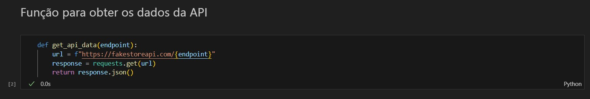
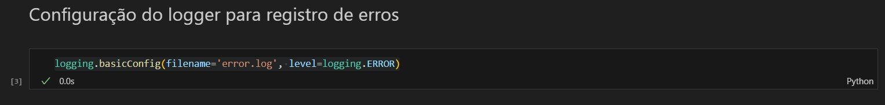
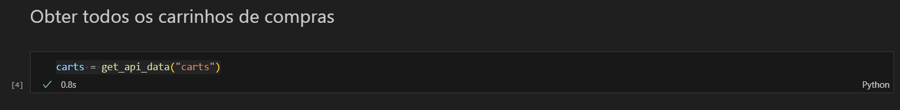
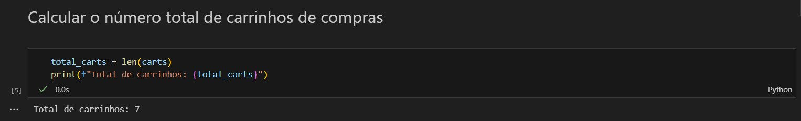
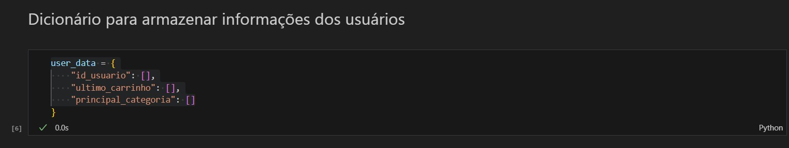
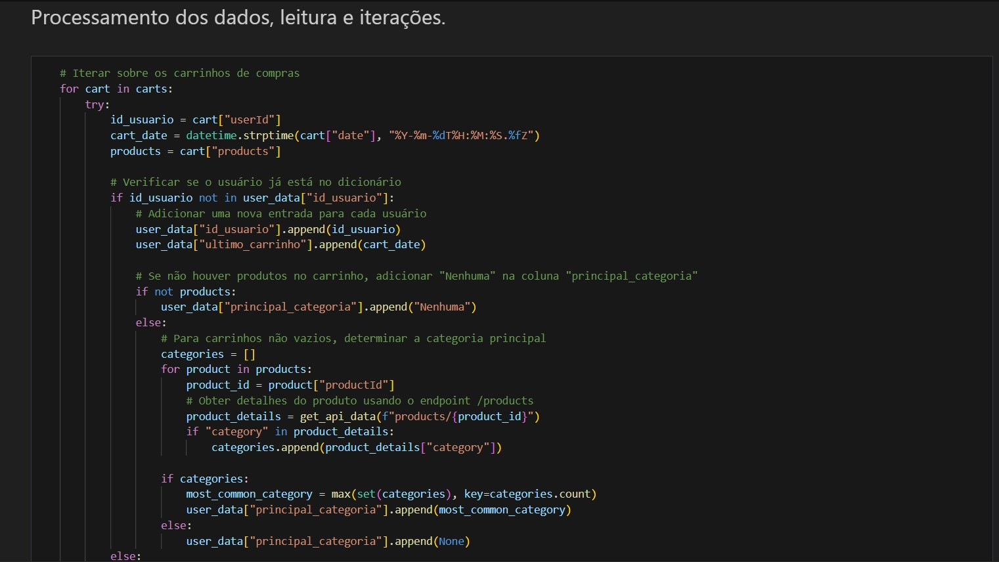
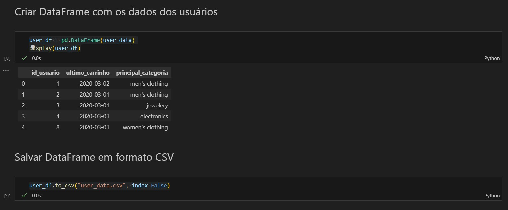

# Consumindo e Persistindo Dados da Fake Store API

Este projeto consiste em um teste técnico para a vaga de Pessoa Engenheira de Dados Júnior. O objetivo é consumir dados da API Fake Store, fazer transformações e persistir esses dados em um arquivo no formato CSV. 

A API que será consumida é a [Fake Store](https://fakestoreapi.com/docs).

## Descrição do Projeto

O projeto visa avaliar as habilidades em consumo de dados de uma API, manipulação e persistência dos mesmos. A solução deve ser implementada utilizando Python e disponibilizada em um repositório público no GitHub.


## Instruções de Uso

1. Clone este repositório:

```
git clone https://github.com/UdenalR/teste_enjoei_engenheiro_de_dados
```

2. Instale as dependências necessárias:

```
pip install -r requirements.txt
```

3. Execute o script principal para consumir os dados da API, realizar as transformações e persistir os dados:

```
python main.py
```

4. Verifique o arquivo gerado no diretório `output/`.

## Sobre a API Fake Store

A Fake Store API oferece endpoints para acesso a dados fictícios de produtos, carrinhos de compras e usuários. Consulte a [documentação](https://fakestoreapi.com/docs) para obter mais detalhes sobre os endpoints disponíveis.

## Autores

- [Rodrigo Udenal](https://github.com/UdenalR)

### Descrição do print

#### Acessando a API: 


#### Configurando o logger para registro de erros: 


#### Obtendo os carrinhos da API: 


#### Contagem do número de carrinhos: 


#### Inicializando o dicionário de dados do usuário: 


#### Processamento dos dados, leitura e iterações:
,(Imagens/Imagem6.1.jpg)

Nesta parte do código, estamos processando os dados dos carrinhos de compras. Aqui, iteramos sobre cada carrinho e atualizamos as informações do usuário em um dicionário `user_data`. 

- **Triagem e vinculação de dados:** Antes de adicionar os produtos aos carrinhos no `user_data`, realizamos uma triagem de dados vinculando os produtos presentes nos carrinhos da API `carts` com os produtos obtidos da API `Products`. Isso nos permite associar cada produto a uma categoria específica, o que é essencial para gerar o conjunto de dados final.
- **Iteração sobre os carrinhos:** Utilizamos um loop `for` para percorrer todos os carrinhos de compras obtidos da API.
- **Atualização das informações do usuário:** Verificamos se o usuário já está no dicionário `user_data`. Se não estiver, adicionamos uma nova entrada para o usuário com seu ID e a data do carrinho mais recente. Se o usuário já estiver no dicionário, verificamos se o carrinho atual é mais recente do que o anteriormente registrado. Em seguida, atualizamos a data do carrinho mais recente e, se houver produtos no carrinho, determinamos a categoria principal com base nos produtos.
- **Tratamento de exceções:** Implementamos um bloco `try-except` para lidar com possíveis erros durante o processamento dos carrinhos. Em caso de erro, registramos uma mensagem de erro no arquivo de log.

Após o término da iteração é exibido o total de registros processados.

#### Criando DataFrame e salvando em CSV: 

```